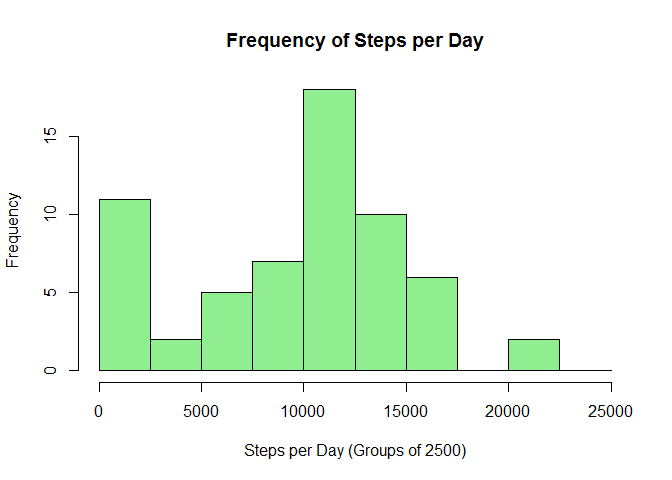
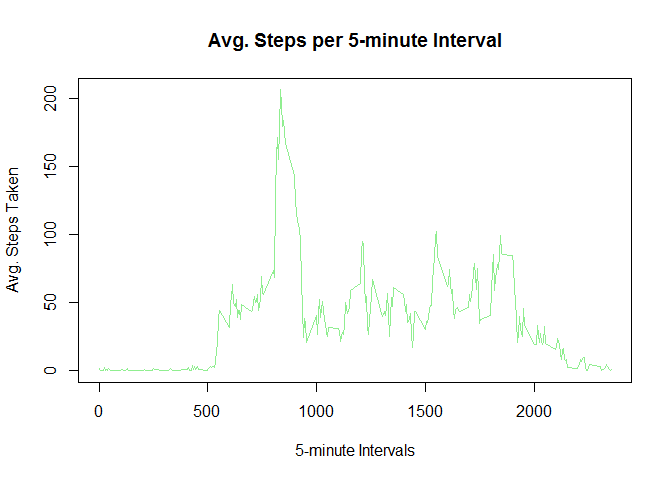
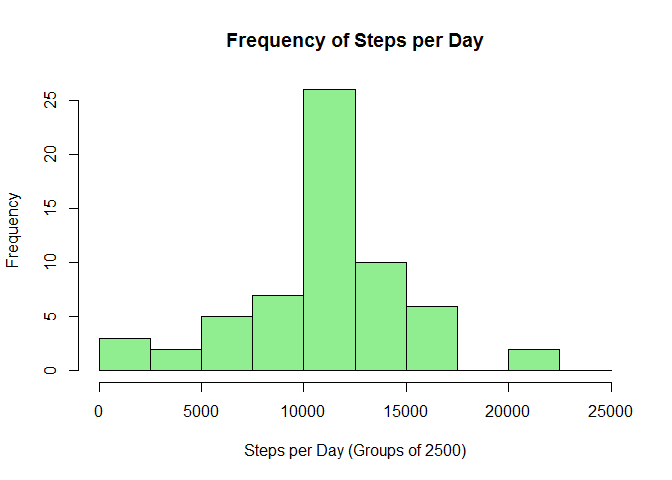
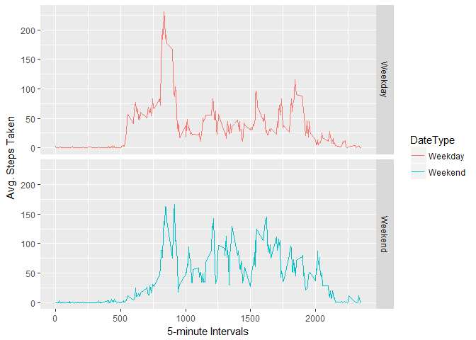

Untitled
================

Loading required packages
-------------------------

``` r
require(ggplot2)
```

    ## Loading required package: ggplot2

Loading and preprocessing the data
----------------------------------

``` r
if(!file.exists("./data")){dir.create("./data")}
fileUrl = "https://d396qusza40orc.cloudfront.net/repdata%2Fdata%2Factivity.zip"
download.file(fileUrl, destfile = "./data/Activity-monitoring-data.zip")

dl = unzip(zipfile = "./data/Activity-monitoring-data.zip", exdir = "./data")
dt.Raw = read.csv(dl)
```

What is the Mean total numbers of steps taken per day?
------------------------------------------------------

#### For this part of the assignment we're ignoring missing values in the dataset

#### 1 - Calculating the total number of steps taken per day

``` r
dt.Steps = aggregate(list(Steps = dt.Raw$steps), by = list(Date = dt.Raw$date), FUN = sum, na.rm = TRUE)

dt.Steps
```

    ##          Date Steps
    ## 1  2012-10-01     0
    ## 2  2012-10-02   126
    ## 3  2012-10-03 11352
    ## 4  2012-10-04 12116
    ## 5  2012-10-05 13294
    ## 6  2012-10-06 15420
    ## 7  2012-10-07 11015
    ## 8  2012-10-08     0
    ## 9  2012-10-09 12811
    ## 10 2012-10-10  9900
    ## 11 2012-10-11 10304
    ## 12 2012-10-12 17382
    ## 13 2012-10-13 12426
    ## 14 2012-10-14 15098
    ## 15 2012-10-15 10139
    ## 16 2012-10-16 15084
    ## 17 2012-10-17 13452
    ## 18 2012-10-18 10056
    ## 19 2012-10-19 11829
    ## 20 2012-10-20 10395
    ## 21 2012-10-21  8821
    ## 22 2012-10-22 13460
    ## 23 2012-10-23  8918
    ## 24 2012-10-24  8355
    ## 25 2012-10-25  2492
    ## 26 2012-10-26  6778
    ## 27 2012-10-27 10119
    ## 28 2012-10-28 11458
    ## 29 2012-10-29  5018
    ## 30 2012-10-30  9819
    ## 31 2012-10-31 15414
    ## 32 2012-11-01     0
    ## 33 2012-11-02 10600
    ## 34 2012-11-03 10571
    ## 35 2012-11-04     0
    ## 36 2012-11-05 10439
    ## 37 2012-11-06  8334
    ## 38 2012-11-07 12883
    ## 39 2012-11-08  3219
    ## 40 2012-11-09     0
    ## 41 2012-11-10     0
    ## 42 2012-11-11 12608
    ## 43 2012-11-12 10765
    ## 44 2012-11-13  7336
    ## 45 2012-11-14     0
    ## 46 2012-11-15    41
    ## 47 2012-11-16  5441
    ## 48 2012-11-17 14339
    ## 49 2012-11-18 15110
    ## 50 2012-11-19  8841
    ## 51 2012-11-20  4472
    ## 52 2012-11-21 12787
    ## 53 2012-11-22 20427
    ## 54 2012-11-23 21194
    ## 55 2012-11-24 14478
    ## 56 2012-11-25 11834
    ## 57 2012-11-26 11162
    ## 58 2012-11-27 13646
    ## 59 2012-11-28 10183
    ## 60 2012-11-29  7047
    ## 61 2012-11-30     0

### 2 - Creating a Histogram of total number of steps taken each day

``` r
hist(dt.Steps$Steps, breaks = seq(0,25000, by = 2500), col = "lightgreen", main = "Frequency of Steps per Day", xlab = "Steps per Day (Groups of 2500)", ylab = "Frequency")
```



#### 3 - Calculating the mean & median number of steps per day

``` r
mean(dt.Steps$Steps)
```

    ## [1] 9354.23

``` r
median(dt.Steps$Steps)
```

    ## [1] 10395

What is the average daily activity pattern?
-------------------------------------------

#### For this part of the assignment we're continuing to ignore missing values in the dataset

``` r
dt.DailyActivityPattern = aggregate(list(Steps = dt.Raw$steps), by = list(Interval = dt.Raw$interval), FUN = mean, na.rm = TRUE)
```

#### 1 - Making a time series plot of the average steps taken in every 5-minute interval

``` r
plot(dt.DailyActivityPattern$Interval, dt.DailyActivityPattern$Steps, type = "l", col = "lightgreen", main = "Avg. Steps per 5-minute Interval", xlab = "5-minute Intervals", ylab = "Avg. Steps Taken")
```



#### 2 - Finding which interval, on average, has the maximum number of steps taken per day

``` r
dt.DailyActivityPattern[which.max(dt.DailyActivityPattern$Steps),]
```

    ##     Interval    Steps
    ## 104      835 206.1698

Imputing missing values
-----------------------

#### 1 - Calculating total number of missing values in the dataset

``` r
sum(is.na(dt.Raw$steps))
```

    ## [1] 2304

#### 2/3 - Replacing all missing values with the avg. steps of that interval

``` r
dt.NA = is.na(dt.Raw$steps)
dt.AvgInterval = tapply(dt.Raw$steps, dt.Raw$interval, mean, na.rm = TRUE, simplify = TRUE)
dt.Imputed = dt.Raw
dt.Imputed$steps[dt.NA] = dt.AvgInterval[as.character(dt.Imputed$interval[dt.NA])]
```

#### Recalculating total number of missing values in the dataset

``` r
sum(is.na(dt.Imputed$steps))
```

    ## [1] 0

#### 4a - Creating a Histogram of total number of steps taken each day

``` r
dt.StepsImputed = aggregate(list(Steps = dt.Imputed$steps), by = list(Date = dt.Imputed$date), FUN = sum, na.rm = TRUE)

hist(dt.StepsImputed$Steps, breaks = seq(0,25000, by = 2500), col = "lightgreen", main = "Frequency of Steps per Day", xlab = "Steps per Day (Groups of 2500)", ylab = "Frequency")
```



#### 4b - Calculating the mean & median number of steps per day

``` r
mean(dt.StepsImputed$Steps)
```

    ## [1] 10766.19

``` r
median(dt.StepsImputed$Steps)
```

    ## [1] 10766.19

Are there differences in activity patterns between weekdays and weekends?
-------------------------------------------------------------------------

#### 1 - Creating new variable "DateType"

``` r
dt.Dates = dt.Imputed
dt.Dates$Day = weekdays(as.POSIXlt(dt.Imputed$date))
dt.Dates$DateType = ifelse(dt.Dates$Day %in% c("Saturday","Sunday"),"Weekend", "Weekday")
```

#### 2 - Creating a panel plot with average number of steps taken per interval on Weekdays and Weekends

``` r
dt.DatesAgg = aggregate(data = dt.Dates, steps ~ interval + DateType, mean)

ggplot(dt.DatesAgg, aes(interval, steps, color = DateType)) + 
        geom_line() + 
        facet_grid(DateType ~ .) +
        xlab("5-minute Intervals") + 
        ylab("Avg. Steps Taken")
```


